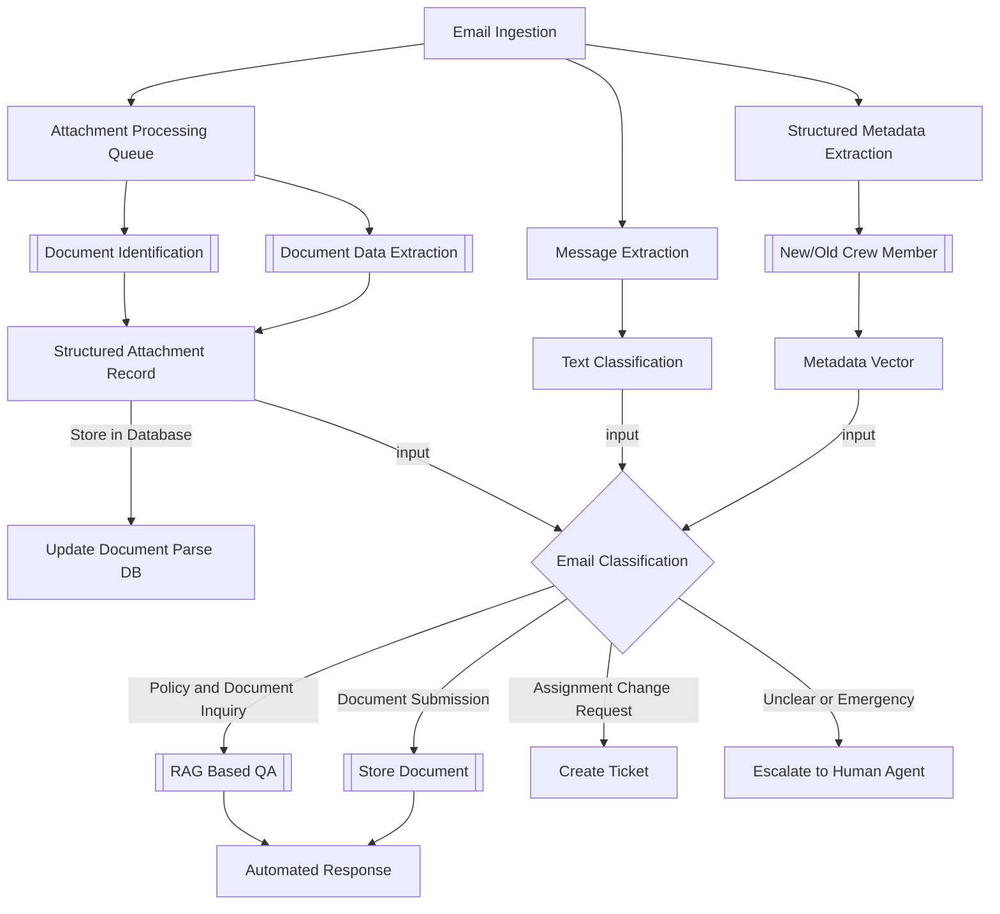

# Ideas for email Ingestion

## Email Classification:
The system will classify incoming emails into the following categories:
 - Policy and Document Inquiry: Requests related to policies, assignments, or required documents.
 - Assignment Change Request: Emails requesting a change to a crew member’s assignment.
 - Document Submission: Emails where crew members are submitting required documents (e.g., passports).
 - Unclear or Emergency Requests: Emails that do not fall under the above categories or require immediate human intervention.

## Email Processing or Decisions
 - Cued Email Responses for Review:
   - For classified emails (Policy and Document Inquiry, Document Submission), the system will generate an automated response.
   - AI will access data from policies (PDFs, Word docs) and assignments (SQL database) to tailor the response.

 - Workflow Integration:
   - Automatically create tickets for Assignment Change Requests, which will be routed to the appropriate manager for review.
   - Provide escalation to human agents for emails classified as Unclear or Emergency.
 - Data Storage and Extraction:
   - Store incoming emails along with their classification in a database.
   - Extract data from submitted documents (e.g., passport details) and store it in a structured format for easy access.
 - Monitoring and Tracking:
   - Users can track the status of each email through the system.
   - A dashboard will allow the Crew Planning team to review emails, monitor AI classification accuracy, and track the progress of each email.

**Email Classification Components**
 1. Structured Metadata Extraction. {From, to, subject, date etc}
 2. New/Old Crew Member
 3. Message Extraction
 4. Attachment Processing Queueue
 5. Document Identification 
 6. Text Classification
 7. Prepopulate features from historical data.

**Possible statuses**
 - Processing
 - Tagged for Manual Review
 - Completed
 - Awaiting User Input

## Component Explaination

## Classification Framework

