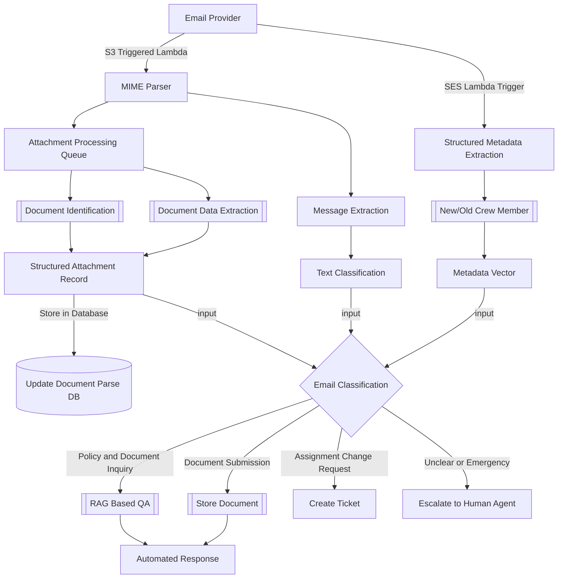
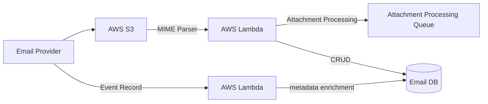

# Email Processing Pipeline

## Introduction
The email processing pipeline is designed to automate the handling of incoming emails related to crew planning. The system will classify emails, extract relevant information, and generate responses or create tickets as needed. The goal is to streamline the process, reduce manual intervention, and improve response times. Following 2 sections are recovered from previously published documents and are used as a reference for the current document.

### Email Classification:
The system will classify incoming emails into the following categories:
 - Policy and Document Inquiry: Requests related to policies, assignments, or required documents.
 - Assignment Change Request: Emails requesting a change to a crew member’s assignment.
 - Document Submission: Emails where crew members are submitting required documents (e.g., passports).
 - Unclear or Emergency Requests: Emails that do not fall under the above categories or require immediate human intervention.

### Email Processing or Decisions
 - Cued Email Responses for Review:
   - For classified emails (Policy and Document Inquiry, Document Submission), the system will generate an automated response.
   - AI will access data from policies (PDFs, Word docs) and assignments (SQL database) to tailor the response.

 - Workflow Integration:
   - Automatically create tickets for Assignment Change Requests, which will be routed to the appropriate manager for review.
   - Provide escalation to human agents for emails classified as Unclear or Emergency.
 - Data Storage and Extraction:
   - Store incoming emails along with their classification in a database.
   - Extract data from submitted documents (e.g., passport details) and store it in a structured format for easy access.
 - Monitoring and Tracking:
   - Users can track the status of each email through the system.
   - A dashboard will allow the Crew Planning team to review emails, monitor AI classification accuracy, and track the progress of each email.

**Email Classification Components**
 1. Structured Metadata Extraction. {From, to, subject, date etc}
 2. New/Old Crew Member
 3. Message Extraction
 4. Attachment Processing Queue
 5. Document Identification 
 6. Text Classification
 7. Prepopulate features from historical data.

**Possible statuses**
 - Processing
 - Tagged for Manual Review
 - Completed
 - Awaiting User Input

## Workflow Overview

## Detailing Components

### 1. Email Provider
 - AWS SES is assumed to be used for email ingestion. Recieved Emails will be in MIME format and will emit events to AWS SQS.
 - LifeCycle Management: Unique ID for an Email will be used for tracking across the workflow. The unique ID is expected to be provided from AWS SES to AWS SNS or directly from SES.
 - There are 4 sinks for an email to go to:
   - AWS SNS
   - AWS Lambda
   - AWS S3
   - AWS Workmail[Optional]

**Proposed Flow:** [[1]](https://docs.aws.amazon.com/ses/latest/dg/receiving-email-concepts.html#receiving-email-process)
 - AWS S3 Action will be configured to store the emails in S3 bucket.
 - AWS S3 triggers an AWS Lambda function to process the Email using asynchronous event trigger.

The **Event Record** does not contain the email body, but it does contain information about several of the email headers for the incoming message, as well as the results of several tests that Amazon SES performs on incoming messages. This information is proposed to be capturd as it might help to determine any spam or unwanted emails and can be used to also enrich the downstream tasks by adding additional metadata.

Metadata Enrichment includes but not limited to:
 - Basic Email Metadata Headers
 - Identification of New/Old Crew Member
 - Previous Classification/Followup
 - Spam Score
 - Process State
 - Current Assignment

### 2. Attachment Processing
The attachment processing queue will be used to process the attachments in the email. The attachments will be processed in parallel using AWS Lambda functions. The attachments will be stored in a structured format in a database for easy access and retrieval. 

**AWS Bedrock Data Automation (IDA)**: BluePrints will be used to process the documents that are likely mentioned in the email/email chain. Confidence Scores from the output will help in determining to discard the document or validate. Sample datasets of common Nationalities can be procured to validate the model output. 
For other documents, 

### Classification Framework

