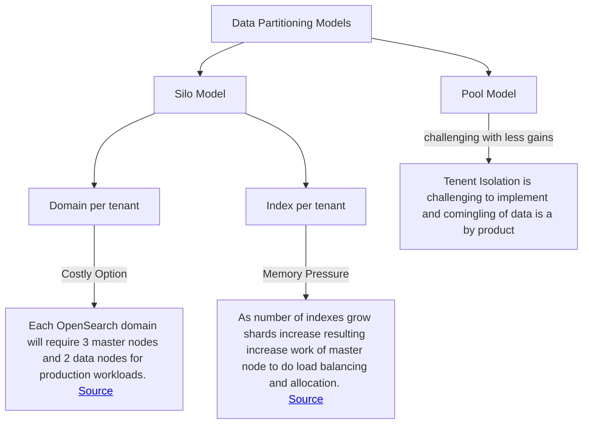
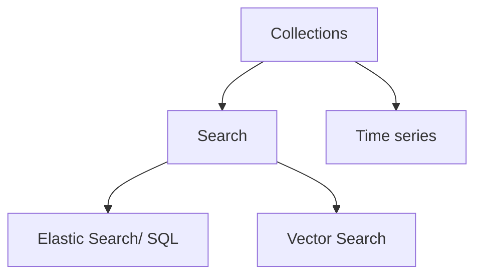

## Research for Serverless Vs Provisioned OpenSearch Deployments

This document provides a brief overview of the differences between serverless and provisioned OpenSearch deployments, focusing on the advantages and disadvantages of each approach. It also includes the development workflow in each of the cases.

#### 1. OpenSearch Service 

#### 1.1 Data Partitioning Models

**TL;DR**: Pooling Model comingles data and controls access through fine-grained access control where as Silo Model would either need to create a separate cluster or create separate indexes to achieve data isolation. 

 - **Silo Model**
  In the silo model, each tenant’s data is stored in a distinct storage area where there is no commingling of tenant data. You can use two approaches to implement the silo model with OpenSearch Service: domain per tenant and index per tenant.

 - **Pool Model**
  In the pool model, all tenant data is stored in a shared index with a tenant ID as the partition key. This simplifies management and improves efficiency compared to maintaining multiple indexes. However, it sacrifices tenant isolation and may suffer from performance issues due to the noisy neighbor effect.

### 2. OpenSearch Serverless

Create semantically separate collections and use **IAM Roles** and **Data Access policies** to control access to the collections. Completely managed deployment by automatically upgrading the collections and Encryption is used by default.

**Amazon OpenSearch Ingestion** to configure a simple pipeline and ingest data into an Amazon OpenSearch Serverless collection. A pipeline is a resource that OpenSearch Ingestion provisions and manages. You can use a pipeline to filter, enrich, transform, normalize, and aggregate data.

### Insights & Recommendations
