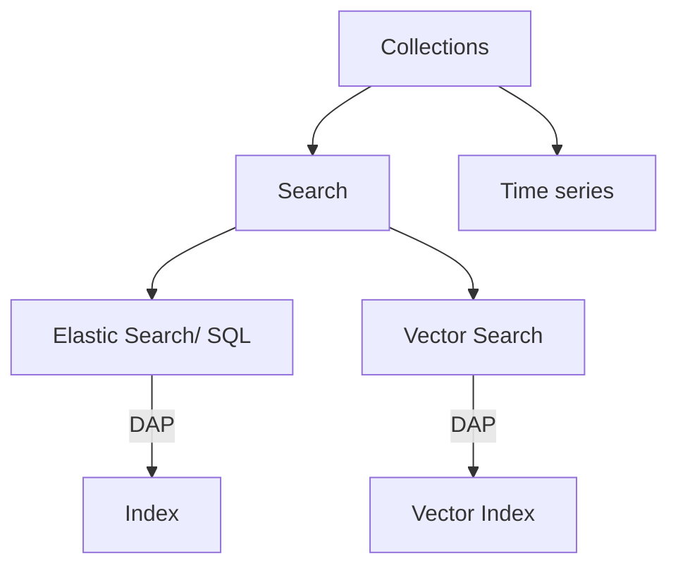

## Research for Serverless Vs Provisioned OpenSearch Deployments

This document provides a brief overview of the differences between serverless and provisioned OpenSearch deployments, focusing on the advantages and disadvantages of each approach. It also includes the development workflow in each of the cases.

#### 1. OpenSearch Service 

##### 1.1 Data Partitioning Models

**TL;DR**: Pooling Model comingles data and controls access through fine-grained access control where as Silo Model would either need to create a separate cluster or create separate indexes to achieve data isolation. 

 - **Silo Model**
  In the silo model, each tenant’s data is stored in a distinct storage area where there is no commingling of tenant data. You can use two approaches to implement the silo model with OpenSearch Service: domain per tenant and index per tenant.

 - **Pool Model**
  In the pool model, all tenant data is stored in a shared index with a tenant ID as the partition key. This simplifies management and improves efficiency compared to maintaining multiple indexes. However, it sacrifices tenant isolation and may suffer from performance issues due to the noisy neighbor effect.

#### 2. OpenSearch Serverless

Create semantically separate collections and use **IAM Roles** and **Data Access Policies(DAP)** to control access to the collections. Infra and Deployment is Completely managed deployment by AWS.

#### Data Ingestion

**Amazon OpenSearch Ingestion** will be used to configure pipelines and ingest data into an Amazon OpenSearch Serverless collection/domain. A pipeline is a resource that OpenSearch Ingestion provisions and manages. It can be used as a pipeline to filter, enrich, transform, normalize, or aggregate data.

**TL;DR**
This is **common** for both serverless and provisioned deployments. Where each data type/source has its own pipeline. 

#### Ideal Scenario For Total Data Isolation and Performance

 - Having multiple domains (Silo -> Domain/tenant) for each tenant is ideal for security and isolation. However, it is costly and requires more management overhead. Ideally, one shared domain for all tenants and 3 individual domains for each tenant.
 - But this quickly becomes a very costly option as it would require provisioning atleast **15 nodes** (3 master nodes and 2 data nodes for each domain) for production workloads.

#### Recommendation

 - **Serverless** is inherently a **domain per tenant** model without the added cost of having to maintain multiple clusters for each domain. 
 - It is a good option for small to medium workloads as only per compute is charged. Here **domain** is synonymous with **collection**. Here creating multiple collections allows us to create a dedicated collection tuned for each **selected workload.**
 - Until the data volume is large enough to warrant a dedicated cluster, serverless is the best option.

